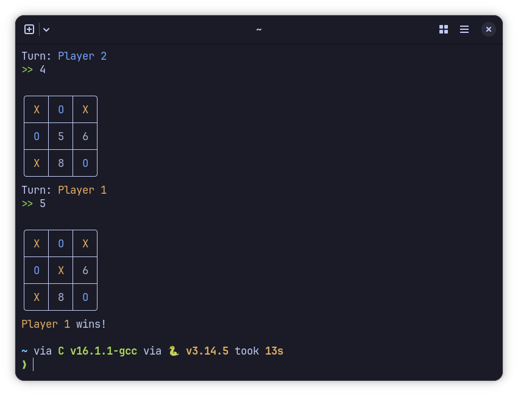

# TicTacToe-CLI

Hello y'all, if you're bored at school/work you can now compile this and play with your friend while hopefully not getting caught by the teacher/manager.
It's a stupid simple game, I hope my code is readable enough for you to make out what I am doing without having a stroke

## How to compile
Grab the pre-compiled ones or run gcc/clang TicTacToe.c -std=c99 -o TicTacToe (.exe if on Windows, nothing on Linux and Mac)

## How to win
Just don't lose 👍
